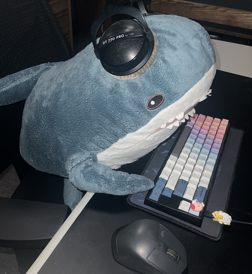

## Welcome to my Github!

I'm Eric Lee, CS + Math at Caltech!
- Personal Website: [ericchanlee.com](https://www.ericchanlee.com)
- I'm interested in Functional Programming, Compilers, Programming Languages, Formal Verification
- Terminally on Neovim
- 📫 Send me cool articles and papers

<!--
Previously worked on:
- SWE Intern @ Jane Street (2025)
- Research on Active Learning of Molecular Properties @ Caltech (2024)
- SWE Intern @ Amazon (2023)
- Microcontrollers on Lunar Rovers @ Caltech/JPL (2022)
- Research on Computational Fluid Dynamics of CD8+ T-Cells @ UCI (2021)
-->

